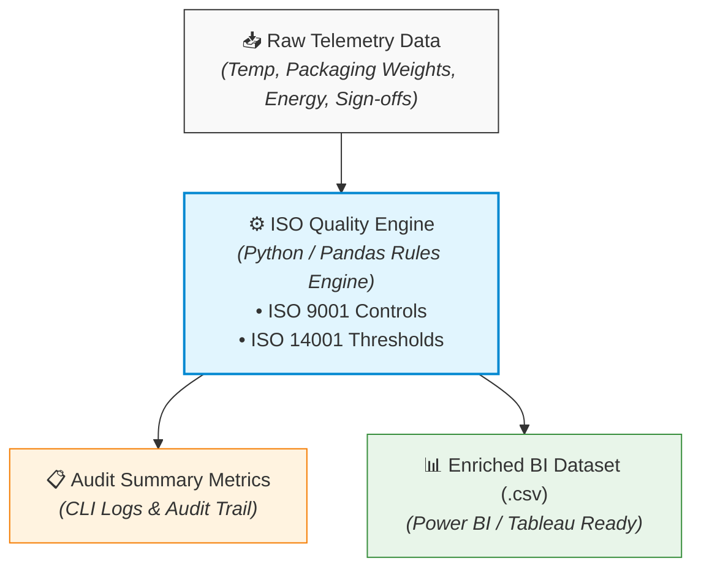

# 🛡️ ISO Quality & Environmental Data Automation Engine
> An automated Quality Assurance and Data Pipeline for Food Industry Compliance (ISO 9001 & ISO 14001)

[](https://www.python.org/downloads/)
[](https://github.com/psf/black)
[](https://docs.pytest.org/)
[](LICENSE)

---

## 📌 Executive Overview

In the food manufacturing industry, maintaining strict adherence to **ISO 9001 (Quality Management)** and **ISO 14001 (Environmental Management)** standards is crucial. Traditional compliance auditing often relies on manual logs, delayed reporting, and error-prone Excel spreadsheets.

The **ISO Quality & Environmental Data Automation Engine** addresses this operational bottleneck by providing an automated **ETL (Extract, Transform, Load)** pipeline. Built with **Python** and **Pandas**, this tool ingests raw factory telemetry and operator logs, validates every batch against programmatic quality and environmental thresholds, logs detailed audit trails for non-conformances, and exports BI-ready datasets for real-time reporting in **Power BI**, **Tableau**, or **Streamlit**.

---

## ✨ Key Features & Capabilities

* 📥 **Automated Data Ingestion:** Reads multi-source factory telemetry, HACCP temperature records, packaging metrics, and operator sign-offs.
* 🎯 **ISO 9001 Quality Validation:**
  * **Temperature Monitoring:** Automatically flags batches exceeding safe Cold Chain limits ($2.0^\circ\text{C} - 4.0^\circ\text{C}$).
  * **Net Weight Control:** Assesses package weight tolerances ($500\text{g} \pm 5\text{g}$) to prevent under-filling or yield loss.
  * **Traceability & Governance:** Ensures mandatory Quality Assurance operator sign-off is logged per batch.
* 🌿 **ISO 14001 Environmental Tracking:**
  * **Energy Consumption Checks:** Monitors energy usage per batch, flagging spikes that exceed environmental benchmarks ($>150\text{ kWh}$).
* 🔍 **Granular Audit Trails:** Automatically compiles detailed failure reason codes for quick root-cause analysis and corrective action (CAPA).
* 🧪 **Automated Software SQA:** Includes unit testing built with `pytest` to guarantee rule engine reliability and prevent regressions.
* 📊 **BI-Ready Analytics Export:** Formats and exports clean, enriched data directly consumed by Business Intelligence tools.

---

## 🏗️ System Architecture & Workflow



## 🚀 Quick Start Guide

### Prerequisites
* **Python 3.9+**
* **Git**

### 1. Clone the Repository
```bash
git clone [https://github.com/Laura-Torres-portfolio/project-1.git](https://github.com/Laura-Torres-portfolio/project-1.git)
cd project-1
